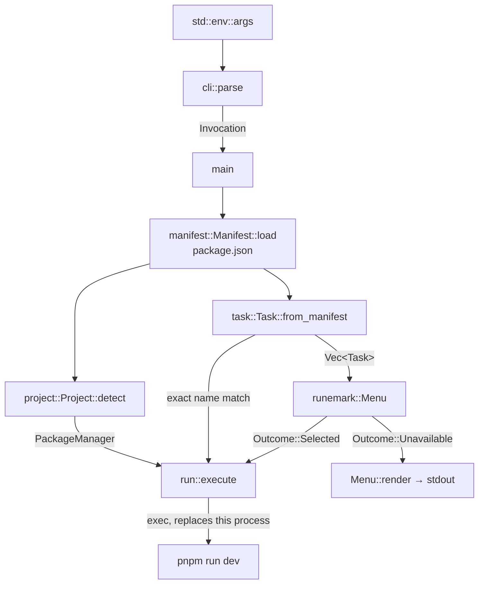

# Architecture

What exists today. `opi` lists a project's `package.json` scripts and runs the
one you pick. Health, updates, clean and security are not built.

## Modules

```
src/
├── main.rs      entry point, wiring, all user-facing output
├── cli.rs       argument parsing → Invocation
├── manifest.rs  package.json → Manifest, searching upwards
├── workspace.rs workspace patterns → member manifests
├── project.rs   Manifest + directory → Project (name, package manager)
├── task.rs      Manifest + members → Vec<Task>, grouped and ordered
└── run.rs       Task → the running script
```

## Flow



`package.json` is parsed once, by `manifest.rs`, and the result is shared by
project detection and the task model. Neither re-reads the file.

## Finding the project

`Manifest::discover` searches the working directory and then its parents, so
`opi` works from anywhere inside a project, as `npm` does. Everything
downstream resolves against the directory the manifest was found in.

Package manager detection searches upwards too. In a workspace the lockfile and
the `packageManager` field live at the root, so a member package carries no
evidence of its own — defaulting to npm there would run the wrong package
manager in a pnpm monorepo.

## Workspaces

`workspace.rs` reads member patterns from `pnpm-workspace.yaml` or the
`workspaces` field, expands them against the filesystem, and loads each
member's manifest. Members without scripts are dropped, as is the root when a
workspace lists `.` among its own packages.

Only the `packages:` block of the YAML is read. Real files carry several
unrelated top-level keys whose values are also lists — `minimumReleaseAgeExclude`
and `trustPolicyExclude` among them — and collecting every `- item` would turn
version pins into workspace packages.

Each member becomes a `Group::Workspace`, sorted after everything the root
owns.

**A member script whose name the root also defines is left out.** The root
already wins that name on the command line, so listing both offers a choice the
interface cannot honour, and in practice the root's script wraps the members'.
Measured on one real project this removed 12 of 18 member entries, none of
which carried a description; what remained was exactly what the root cannot
reach. A member left with nothing shows no group at all.

### Addressing a member

Root and member scripts share names in every workspace repository measured, so
a bare name is not enough. `opi dev` runs the root's script; `opi blog/dev`
runs the member's, and a scoped package answers to its short name as well
(`blog/dev` reaches `@casoon/blog`). An exact match on the whole name is tried
first, so a script literally containing a slash would still win.

Each package manager spells the member differently, and in a different
position: `pnpm --filter <m> run <s>`, `yarn workspace <m> run <s>`,
`npm run <s> --workspace=<m>`, `bun run --filter <m> <s>`.

## The task model is the single abstraction

`Task` is what the interactive list, the command line and the search all
operate on. It carries the workspace member it belongs to, if any. `opi dev` and selecting `dev` from the list reach
`run::execute` by different routes but with the same value.

This is deliberate: if the two ever need separate handling, the boundary has
been broken. Built-in actions and tool checks are meant to join `Task` rather
than arrive as a parallel type.

## Grouping

`task::Group` derives `Ord`, so group order is the order its variants are
declared — `Development`, `Build`, `Preview`, `Quality`, then unrecognised
prefixes alphabetically, then the catch-all. There is no separate sort
function to keep in step.

Two rules are less obvious than they look:

- A script with no prefix that heads a family joins that family. `deploy`
  belongs with `deploy:blog` and `deploy:starter`, not in the catch-all.
- Lifecycle hooks npm runs on its own (`prebuild` where `build` exists) are
  hidden. The check is guarded against recognised groups, because `preview`
  strips to `view`.

## Execution

`run::execute` replaces the process through `exec`. The script inherits the
terminal, the signals and the exit status, so `Ctrl-C` reaches a dev server
instead of killing a wrapper, and `opi build && …` works in a shell chain.
`opi` does not return to its list afterwards, because it no longer exists.

This is why `opi` is Unix-only — see [constraints.md](constraints.md).

npm is the only package manager given a `--` before forwarded arguments; it
needs the separator to tell its own flags from the script's and strips it,
while the others would pass a literal `--` through.

## Presentation

Every user-facing string comes from [runemark](https://github.com/casoon/runemark).

- The list is a `runemark::Menu`, built in `main::build_menu`. Item ids are
  script names, so a selection is ready to run.
- A list larger than the terminal is fitted to it by runemark: taller lists
  scroll, and entries are shortened rather than wrapped.
- `/` filters the menu. Matching lives in runemark and works on what the menu
  displays; `task::suggestions` is a separate thing, correcting a mistyped name
  on the command line where there is no list to filter.
- Interactive selection needs runemark's `select` feature and both stdout and
  stderr to be terminals — stdout decides whether output is being captured,
  and the menu draws its frames on stderr.
- Where that does not hold, `Menu::render` prints the same layout as plain
  text. One menu definition serves both paths.
- Errors are `runemark::ErrorBlock` on stderr.
