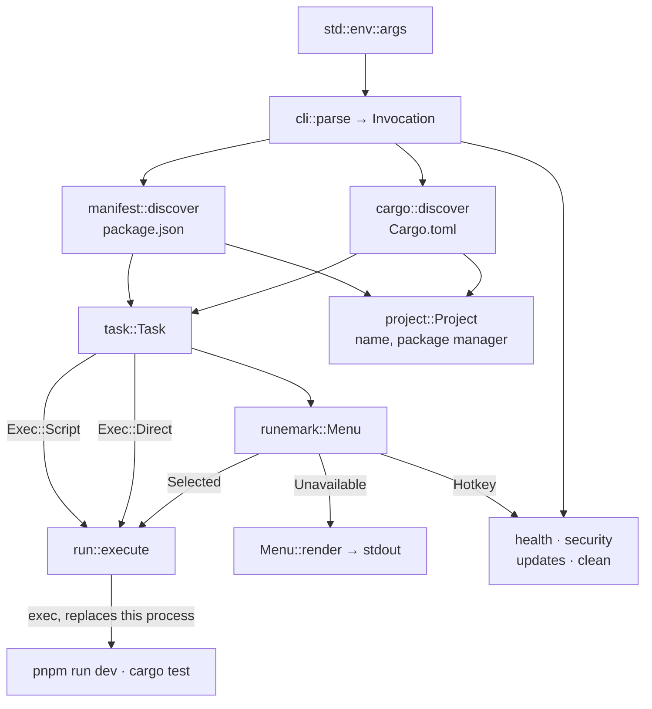

# Architecture

What exists today. `opi` lists a project's `package.json` scripts and runs the
one you pick, and offers five areas beside that: health, security, updates,
clean, and named workflows.

## Modules

```
src/
├── main.rs      entry point, wiring, all user-facing output
├── cli.rs       argument parsing → Invocation
├── manifest.rs  package.json → Manifest, searching upwards
├── cargo.rs     Cargo.toml → a Rust project and its commands
├── workspace.rs workspace patterns → member manifests
├── project.rs   Manifest + directory → Project (name, package manager)
├── task.rs      Manifest + members → Vec<Task>, grouped and ordered
├── run.rs       Task → the running script
├── check.rs     detect a project's tools, run them concurrently
├── audit.rs     package manager audit → parsed advisories
├── outdated.rs  package manager outdated → updates by semver jump
├── clean.rs     removable artefacts, measured before they are offered
└── workflow.rs  named sequences of checks, plus repository gates
```

## Flow



Each manifest is parsed once and the result is shared by project detection, the
task model and the checks. Nothing re-reads a file.

Both discoveries run, and either may come back empty; only both being empty is
an error. A Rust-only project stands on an empty `Manifest`, which answers every
question about scripts with "none" and needs no special case downstream.

The `opi` block inside it is deliberately held as unparsed JSON and read
leniently, field by field. Typed into a struct, one field of the wrong type
would fail the whole parse and make `opi` useless in a project whose `scripts`
are perfectly fine; read this way, a `favorite` that is a string costs that one
field.

It carries per-script metadata — `description`, `group`, `favorite`, `confirm` —
and the `clean` path list. All of it is refinement: nothing here may be required
for a screen to work, or the zero-configuration rule is broken.

## Finding the project

`Manifest::discover` searches the working directory and then its parents, so
`opi` works from anywhere inside a project, as `npm` does. Everything
downstream resolves against the directory the manifest was found in.

`cargo::discover` does the same for `Cargo.toml`, and **both run**. A
repository may be more than one kind of project at once — measured across 231
directories here, 133 carry a `package.json`, 51 a `Cargo.toml`, and twelve
both — so neither is allowed to win. A repository with only a `Cargo.toml` is a
project too; 39 of them were previously turned away with "No package.json
found".

A .NET marker appeared in none of those directories on its own, so that half of
the original plan is not built. The same reasoning retired Knip and taze.

Package manager detection searches upwards too. In a workspace the lockfile and
the `packageManager` field live at the root, so a member package carries no
evidence of its own — defaulting to npm there would run the wrong package
manager in a pnpm monorepo.

## Workspaces

`workspace.rs` reads member patterns from `pnpm-workspace.yaml` or the
`workspaces` field, expands them against the filesystem, and loads each
member's manifest. Members without scripts are dropped, as is the root when a
workspace lists `.` among its own packages.

Only the `packages:` block of the YAML is read. Real files carry several
unrelated top-level keys whose values are also lists — `minimumReleaseAgeExclude`
and `trustPolicyExclude` among them — and collecting every `- item` would turn
version pins into workspace packages.

Each member becomes a `Group::Workspace`, sorted after everything the root
owns.

**A member script whose name the root also defines is left out.** The root
already wins that name on the command line, so listing both offers a choice the
interface cannot honour, and in practice the root's script wraps the members'.
Measured on one real project this removed 12 of 18 member entries, none of
which carried a description; what remained was exactly what the root cannot
reach. A member left with nothing shows no group at all.

### Addressing a member

Root and member scripts share names in every workspace repository measured, so
a bare name is not enough. `opi dev` runs the root's script; `opi blog/dev`
runs the member's, and a scoped package answers to its short name as well
(`blog/dev` reaches `@casoon/blog`). An exact match on the whole name is tried
first, so a script literally containing a slash would still win.

Each package manager spells the member differently, and in a different
position: `pnpm --filter <m> run <s>`, `yarn workspace <m> run <s>`,
`npm run <s> --workspace=<m>`, `bun run --filter <m> <s>`.

## The task model is the single abstraction

`Task` is what the interactive list, the command line and the search all
operate on. It carries the workspace member it belongs to, if any, and how to
start it — `Exec::Script` goes through the package manager, `Exec::Direct`
names its own program. That second variant is what lets a second ecosystem
exist without a second list.

A Rust project defines no scripts, so its commands are a fixed set rather than
something read out of the manifest. They are the ones these repositories
actually run in CI: `fmt --check`, `clippy` with warnings denied, `test
--all-features`. `cargo run` is offered only where something is runnable.

`Cargo.toml` is read without a TOML parser. Two facts are wanted — the package
name and whether a binary exists — and a dependency to learn them would cost
more than they are worth. `opi dev` and selecting `dev` from the list reach
`run::execute` by different routes but with the same value.

This is deliberate: if the two ever need separate handling, the boundary has
been broken. Built-in actions and tool checks are meant to join `Task` rather
than arrive as a parallel type.

## Grouping

`task::Group` derives `Ord`, so group order is the order its variants are
declared — `Development`, `Build`, `Preview`, `Quality`, then unrecognised
prefixes alphabetically, then the catch-all. There is no separate sort
function to keep in step.

A project may override the derived group, or lift a script out of it entirely.
A `group` naming one `opi` already knows takes that group's fixed place, so
configuration refines the meaning-first order rather than escaping it; a
`favorite` becomes its own group at the top, because sorting first *within* a
group of two barely shows.

A favourite in a workspace member stays with its member: lifting it into the
root's Favorites would lose which package it belongs to, and its id would no
longer say.

Two rules are less obvious than they look:

- A script with no prefix that heads a family joins that family. `deploy`
  belongs with `deploy:blog` and `deploy:starter`, not in the catch-all.
- Lifecycle hooks npm runs on its own (`prebuild` where `build` exists) are
  hidden. The check is guarded against recognised groups, because `preview`
  strips to `view`.

## Execution

`run::execute` replaces the process through `exec`. The script inherits the
terminal, the signals and the exit status, so `Ctrl-C` reaches a dev server
instead of killing a wrapper, and `opi build && …` works in a shell chain.
`opi` does not return to its list afterwards, because it no longer exists.

This is why `opi` is Unix-only — see [constraints.md](constraints.md).

npm is the only package manager given a `--` before forwarded arguments; it
needs the separator to tell its own flags from the script's and strips it,
while the others would pass a literal `--` through.

## The areas

All five are reachable two ways: a hotkey in the list, and a flag. Never a bare
word — `health`, `clean`, `release` and `commit` are all script names in real
projects, and the bare word stays theirs.

| Area | Key | Flag | What it does |
| --- | --- | --- | --- |
| Health | `H` | `--health` | Runs every detected check concurrently |
| Security | `S` | `--security` | Secret scan plus a parsed dependency audit |
| Updates | `U` | `--updates` | Outdated dependencies, split by semver jump |
| Clean | `C` | `--clean` | Removable artefacts, with sizes |
| Workflows | — | `--check commit`/`release` | A named subset, plus git gates |

Rust checks are scoped as `rust` even in a Rust-only project: in a repository
carrying both manifests, "Tests" would otherwise mean two different things on
two lines. Rust's `target/` is a clean candidate but not a heavy one — unlike
`node_modules` it is rebuilt by the next build rather than by a network round
trip.

A script the project marked `confirm` is asked about before it runs. Without a
terminal that refuses rather than assuming yes — skipping the question where it
cannot be asked would remove the protection in exactly the case it exists for —
and `--yes` is how to say it out loud in a script.

### Checks

`check.rs` implements none of them. It detects which tool a package depends on,
finds its binary in a `node_modules/.bin` at or above that package, runs it, and
relays the result. Which tools to support was measured across 133 real projects
rather than taken from the plan — Knip, prominent there, was present in one.

Checks run **per workspace member**, not only at the root, and in the member's
own directory: a monorepo keeps TypeScript and its test runner in the packages,
and pnpm does not hoist their binaries.

A non-zero exit means findings, which is a successful run with a result. A tool
that will not start is reported apart from that, since a broken install needs a
different remedy.

Where several tools answer for the same concern, the first detected one runs and
its name is shown, so a result is never anonymous.

### Deleting

`clean.rs` is the only code in `opi` that removes data, and is narrow by
construction: directories inside the project only, never through a symlink,
and a path from `opi.clean` that escapes the project is refused rather than
corrected. A candidate contained in another candidate is dropped, or its bytes
would be counted twice. `node_modules` is never bundled with build artefacts.

## Presentation

Every user-facing string comes from [runemark](https://github.com/casoon/runemark).

### Where a `Report` is used, and where it is not

runemark's `Report` carries a verdict, metrics, grouped findings and next
steps. It is used for the two screens whose data is **parsed** — the dependency
audit and the update list — where it earns its keep: severity counts become
metrics, the safe/breaking split becomes two groups rather than a sentence
under a list, and an advisory's fixed version range becomes a `Remedy`.

It is deliberately **not** used for health, workflows or the secret scan, and
the reason is the same for all three: those relay a tool's own output rather
than parsing it. Tried both ways against real output:

- Everything in one `Finding` collapses the newlines, so a tool's box rules and
  its indentation — which file, which line — turn into a run-on paragraph.
- One `Finding` per line prefixes each with a bullet, flattening the same
  indentation, and reports a count of lines as if it were a count of findings.

Two further reasons hold for health specifically. Its results **stream**: each
check prints as it finishes so a slow test run does not look like a hang — 5.6
seconds on one real workspace — while a report is built and rendered once. And
its status marks belong on the streamed lines, where a report has no say.

A third reason used to hold and no longer does: a `Metric` carried a tone but no
symbol, so with colour off a failing one read exactly like a passing one. That
gap was closed in runemark `0.6` by `Metric::with_verdict`, which the audit's
severity counts now use. It does not change health's answer — streaming and raw
output still decide it — but it is why those counts are legible in a pipe.

- The list is a `runemark::Menu`, built in `main::build_menu`. Item ids are
  script names, so a selection is ready to run.
- A list larger than the terminal is fitted to it by runemark: taller lists
  scroll, and entries are shortened rather than wrapped.
- `/` filters the menu. Matching lives in runemark and works on what the menu
  displays; `task::suggestions` is a separate thing, correcting a mistyped name
  on the command line where there is no list to filter.
- Interactive selection needs runemark's `select` feature and both stdout and
  stderr to be terminals — stdout decides whether output is being captured,
  and the menu draws its frames on stderr.
- Where that does not hold, `Menu::render` prints the same layout as plain
  text. One menu definition serves both paths.
- Errors are `runemark::ErrorBlock` on stderr.
